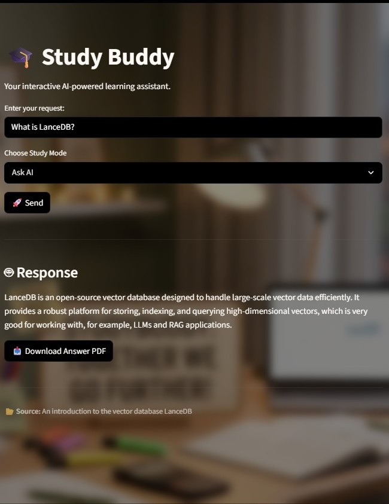
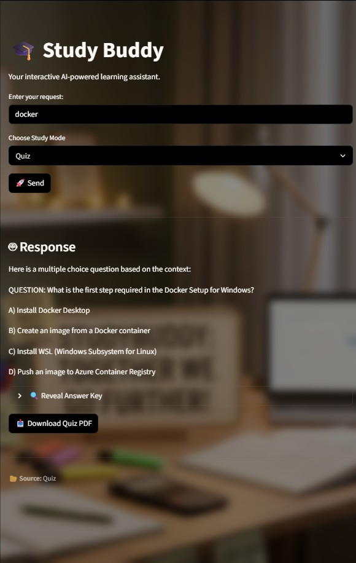
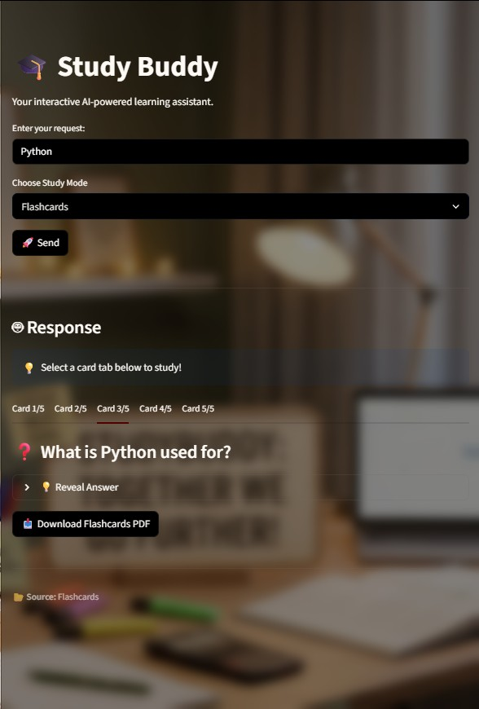
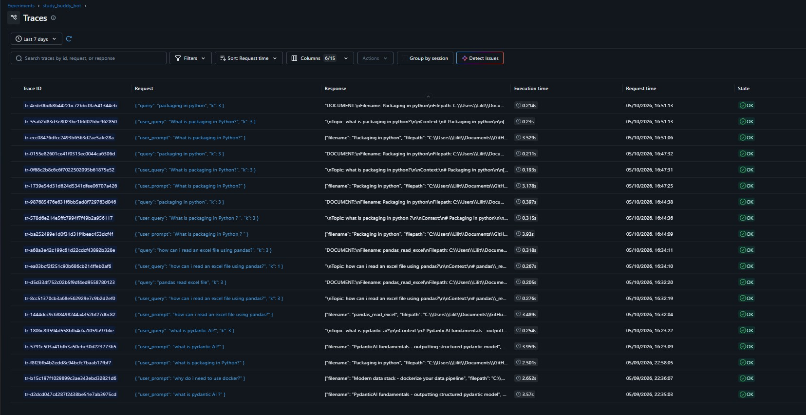

# 📚 Study Buddy RAG – Fullstack LLMOps Project

## 📌 Overview
Study Buddy is a fullstack Retrieval-Augmented Generation (RAG) application developed collaboratively by four students as part of an LLMOps project.

The system uses cleaned lecture transcriptions as its knowledge base and allows users to interact with course material through an AI-powered interface. The application retrieves relevant lecture content from a vector database and generates context-aware answers using a large language model.

The project focuses on practical LLMOps concepts including:

- Retrieval-Augmented Generation (RAG)
- Vector databases
- Prompt engineering
- LLM evaluation and monitoring
- Dockerized services
- Fullstack AI application development

# 📸 Screenshots

## Streamlit Frontend


## Quiz Generation


## Flashcards Generation



## MLflow Monitoring


---

# ✨ Features

## Core RAG Features
- Retrieval-Augmented Generation pipeline
- Semantic search with LanceDB
- Context-aware AI responses
- Source-aware answers with document references
- Lecture-based question answering

## Study Tools
- Basic quiz generation
- Flashcard generation
- PDF export for generated material
- Interactive study assistant interface

## LLMOps Features
- MLflow monitoring and evaluation
- Prompt versioning with MLflow Prompt Registry
- Structured tracing with MLflow
- Modular architecture for scalability
- Dockerized backend and frontend services

---

# 🧠 System Architecture

## Workflow

1. **Data Ingestion**
   - Lecture transcripts are stored as Markdown files in the `data/` folder.
   - The ingestion pipeline processes and stores them in LanceDB.

2. **Embedding & Storage**
   - Documents are embedded using Cohere multilingual embeddings.
   - Embeddings are stored in LanceDB for semantic retrieval.

3. **User Interaction**
   - Users interact through the Streamlit frontend.
   - Requests are sent to the FastAPI backend.

4. **Retrieval**
   - Relevant lecture chunks are retrieved from LanceDB.

5. **Generation**
   - Pydantic-AI agents use retrieved context to generate answers.

6. **Monitoring & Evaluation**
   - MLflow traces requests and metrics.
   - Evaluation scripts score relevance and groundedness.

## ⚙️ Technologies Used

## Backend
- Python 3.13
- FastAPI
- Pydantic-AI
- LanceDB
- MLflow
- OpenRouter API

## Frontend
- Streamlit
- HTTPX
- FPDF

## Infrastructure
- Docker
- Docker Compose
- uv package manager

## 🏗️ Project Structure

```
FULLSTACK_LLMOPS_PROJECT/
│
├── .venv/
├── src/
│   └── study_buddy/
│       ├── backend/
│       │   ├── backend/
│       │   │   ├── agents.py
│       │   │   ├── api.py
│       │   │   ├── constants.py
│       │   │   ├── middlewares.py
│       │   │   └── data_models.py
│       │   │
│       │   ├── pyproject.toml
│       │   └── backend.egg-info/
│       │
│       ├── data/
│       │
│       ├── dockerfiles/
│       │   ├── backend.dockerfile
│       │   └── frontend.dockerfile
│       │
│       ├── explorations/
│       │   └── exploring.ipynb
│       │
│       ├── frontend/
│       │   ├── app.py
│       │   ├── background.jpg
│       │   ├── pyproject.toml
│       │   └── frontend.egg-info/
│       │
│       ├── lancedb/
│       │   └── LectureTranscript.lance/
│       │
│       ├── monitoring/
│       │   ├── monitoring.py
│       │   └── mlflow.db
│       │
│       ├── prompt_engineering/
│       │   ├── prompt_loader.py
│       │   └── rag_agent_system_prompt.md
│       │
│       ├── setup/
│       │   └── ingestion.py
│       │
│       ├── docker-compose.yaml
│       ├── pyproject.toml
│       ├── README.md
│       ├── uv.lock
│       ├── .env
│       ├── .gitignore
│       └── .python-version

```

---

# 📦 Project Configuration

This project uses separate `pyproject.toml` files for the backend and frontend.

This structure allows:

- Independent dependency management
- Clear separation of concerns
- Easier scalability and maintenance
- A workflow similar to real-world fullstack ML systems

The root `pyproject.toml` only contains general project metadata and shared configuration.

---

# 🔐 Environment Variables

Create a `.env` file in the project root:

```env
OPENROUTER_API_KEY=your_key_here
COHERE_API_KEY=your_key_here
```
# 🚀 How to Run the Project

## 1. Install Dependencies

This project uses `uv` as the package manager.

```bash
uv sync
```

## 2. Run the Ingestion Pipeline

Before starting the application, run the ingestion script to create the vector database:

```bash
python setup/ingestion.py
```


## 3. Start the Backend

```bash
uv run uvicorn backend.api:app --reload
```

The backend will run on:

```text
http://localhost:8000
```

## 4. Start the Frontend

```bash
streamlit run frontend/app.py
```

The frontend will run on:

```text
http://localhost:8501
```
---

# 🐳 Docker Setup

The project can also be started using Docker Compose.

## Run with Docker

```bash
docker compose up --build
```

## Services

| Service | URL |
|---|---|
| Frontend | http://localhost:8501 |
| Backend API | http://localhost:8000 |
| MLflow | http://localhost:5000 |

---

# ⚙️ Backend Overview

## FastAPI API
The backend exposes multiple endpoints for interacting with the RAG system.

### Endpoints

| Endpoint | Description |
|---|---|
| `/` | Health check endpoint |
| `/rag/query` | Main RAG question-answering endpoint |
| `/rag/quiz` | Generates quiz questions |
| `/rag/flashcards` | Generates flashcards |


## RAG Agent

The application uses a Pydantic-AI agent configured with:

- OpenRouter LLM integration
- Retrieval tools connected to LanceDB
- Structured output with Pydantic models
- Prompt management through MLflow

The system prompt is versioned and loaded dynamically from MLflow Prompt Registry.

## Vector Database

We use LanceDB as the vector database.

### Stored Data
Each lecture document contains:

- Document name
- File path
- Lecture content
- Vector embeddings

### Embedding Model

```python
embed-multilingual-light-v3.0
```

The dataset currently contains cleaned lecture transcriptions from course material.

---

# 📥 Data Ingestion Pipeline

The ingestion pipeline:

1. Reads Markdown lecture files
2. Cleans and loads lecture content
3. Generates embeddings automatically
4. Stores documents inside LanceDB

The ingestion script can be executed before starting the backend service.

---

# 🎨 Frontend Overview

The frontend is built with Streamlit and provides an interactive learning interface.

## Features
- AI-powered study assistant
- Dark/light mode support
- Quiz generation
- Flashcard generation
- Download generated material as PDF
- Background styling and UI customization

---

# 📊 Monitoring & Evaluation

## MLflow Integration

MLflow is used for:

- Request tracing
- Experiment tracking
- Prompt versioning
- Evaluation logging

## Evaluation Pipeline

The project includes automated evaluation for:

| Metric | Description |
|---|---|
| Relevance | Measures how well answers address the question |
| Groundedness | Measures whether answers stay grounded in retrieved context |

The evaluation pipeline uses an LLM-as-a-judge approach through OpenRouter.

## 🌿 Branching Strategy

We use a simple branching workflow to collaborate on the project.

- `main` → stable version of the project
- separate branches → used by each team member for development

Each team member works on their own branch. Changes are reviewed and tested before being merged into the `main` branch.

All changes are merged through pull requests.

## 🤝 Collaboration
This project is developed collaboratively by a team of four students. Each member works on separate branches to ensure structured collaboration and clear version control.

### Team Members

- [Lilit Ajoyan](https://www.linkedin.com/in/lilit-ajoyan-1565b4183/)
- [Josefin Lesley](https://www.linkedin.com/in/josefin-l-490ab038b/)
- [Erfan Tahmasebi](https://www.linkedin.com/in/erfan-tahmasebi-b41276290/)
- [Leo Lindqvist](https://www.linkedin.com/in/leo-lindqvist-kr%C3%B6hnert-bb0a2b1b5/)

---

# ☁️ Deployment

The application is deployed on Microsoft Azure App Service.

### Live Demo
[Study_buddy](https://studyb-app-anffgfhaehbpgke9.italynorth-01.azurewebsites.net/)

The deployed version includes:

- Streamlit frontend
- FastAPI backend
- Dockerized services
- Cloud-hosted RAG pipeline

The deployment was used to test the system in a production-like environment outside local development.